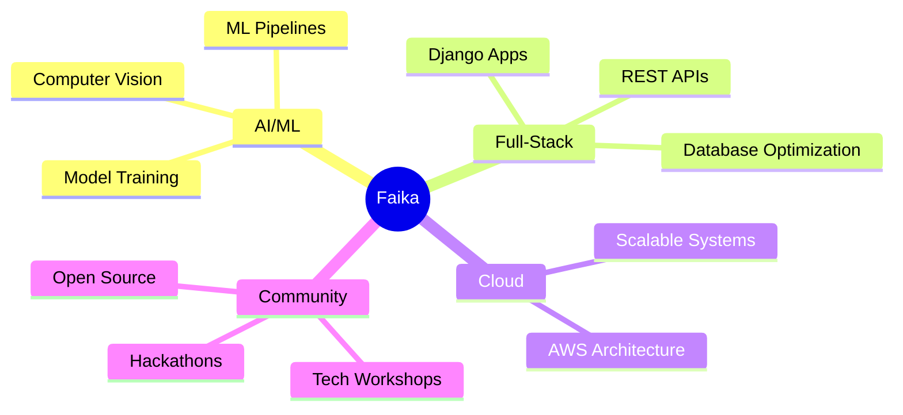

<div align="center">

<!-- Animated Header Banner -->


<!-- Typing Animation -->


<br/>

<!-- Social Badges -->
[]([https://linkedin.com](https://www.linkedin.com/in/faika-mehvish-1935a026a))
[]([https://github.com](https://github.com/FaikaMehvish))
[](mailto:faikamehvish954@gmail.com)
[](#)

<br/>

<!-- Profile views & followers -->


</div>

---

## 🧠 About Me

```python
class FaikaMehvish:
    role       = "Final-Year CSE Student @ PES College of Engineering, Mandya"
    location   = "Karnataka, India 🇮🇳"
    passion    = ["AI/ML", "Full-Stack Dev", "Computer Vision", "Open Source"]
    currently  = "Building intelligent systems that solve real-world problems"
    achievement= "Engineered a 95%+ accuracy Facial Recognition System at a PSU"
    
    def say_hello(self):
        return "I turn caffeine ☕ and curiosity 🔍 into working software 🚀"
```

> *"I don't just write code — I engineer experiences, train models, and build solutions that matter."*

---

## ⚡ Tech Arsenal

<div align="center">

### 🔧 Languages & Core


### 🌐 Web & Backend


### 🗄️ Databases & Tools


### 🤖 AI / ML Stack


</div>

---

## 🏆 Featured Projects

<div align="center">

| 🚀 Project | 🛠️ Tech Stack | 💡 Highlights | 🔗 |
|:-----------|:--------------|:--------------|:--:|
| **💊 Medicine Manager** | Python · Django · MySQL | Full-stack pharmacy inventory with role-based access control & optimized query performance | [View →](#) |
| **🏋️ FitCalc – BMI Assistant** | HTML · CSS · JavaScript | Responsive BMI calculator with real-time validation & instant health categorization | [View →](#) |
| **👁️ Facial Recognition Attendance** | Python · OpenCV · NumPy | **95%+ accuracy** production system deployed at North Bihar PSU — eliminated manual tracking | *Internship* |
| **🌾 AgriML – Hackathon** | Python · ML | ML solution for agricultural inefficiencies; built at Innovate-A-Thon @ PESCE 2024 | *Hackathon* |

</div>

---

## 💼 Experience Spotlight

<table>
<tr>
<td width="60px" align="center">🏢</td>
<td>

**Information Technology Intern** &nbsp;·&nbsp; *Aug – Sep 2025*  
**North Bihar Power Distribution Company Limited (PSU)** — Patna, Bihar

- 🎯 Engineered a **Facial Recognition Attendance System** → **95%+ accuracy**, zero manual tracking
- 🤝 Collaborated cross-functionally to streamline workflows and ensure accurate data reporting
- 🔧 Stack: Python · OpenCV · NumPy

</td>
</tr>
<tr>
<td align="center">☁️</td>
<td>

**AWS APAC Solutions Architecture** &nbsp;·&nbsp; *Aug 2025*  
**Forage Virtual Experience Program**

- 🏗️ Designed scalable cloud architecture using **AWS Elastic Beanstalk**
- 📝 Delivered client-friendly cost-decision documentation

</td>
</tr>
</table>

---

## 📊 GitHub Statistics

<div align="center">


</div>

<div align="center">

[]([https://github.com/faika-mehvish](https://github.com/FaikaMehvish))

</div>

---

## 🎓 Certifications

<div align="center">

| 🏅 Certificate | 🏛️ Issuer | 📅 Year | 🔗 |
|:--------------|:----------|:--------|:--:|
| Software Project Management | **NPTEL** | 2025 | [View](#) |
| Google AI Essentials | **Coursera / Google** | 2024 | [View](#) |
| IBM Intro to ML Specialization | **Coursera / IBM** | 2025 | [View](#) |
| Getting Started with AI | **IBM SkillsBuild** | 2023 | [View](#) |
| Strategy & Data Visualization | **IIT Madras** | 2023 | [View](#) |

</div>

---

## 🌟 Leadership & Community

<div align="center">

```
╔════════════════════════════════════════════════════════════════╗
║  👑  Lead Organizer — PESACT Club @ PESCE  |  2023 – Present  ║
║                                                                ║
║  • 6+ Technical Workshops Organized                           ║
║  • 500+ Student Participants Impacted                         ║
║  • Coordinated volunteer teams across multiple semesters      ║
║  • Delivered hands-on learning experiences in cutting-edge    ║
║    tech domains                                               ║
╚════════════════════════════════════════════════════════════════╝
```

</div>

---

## 🎯 Current Focus

<div align="center">



</div>

---

## 📈 Contribution Activity

<div align="center">

[]([https://github.com/faika-mehvish](https://github.com/FaikaMehvish))

</div>

---

## 🤝 Let's Connect & Collaborate

<div align="center">

> *I'm always open to interesting projects, research collaborations, and conversations about AI/ML!*

[]([https://linkedin.com](https://www.linkedin.com/in/faika-mehvish-1935a026a))
[](mailto:faikamehvish954@gmail.com)
[]([https://github.com](https://github.com/FaikaMehvish))

<br/>

**⭐ If you find my work interesting, consider starring my repositories!**


</div>
